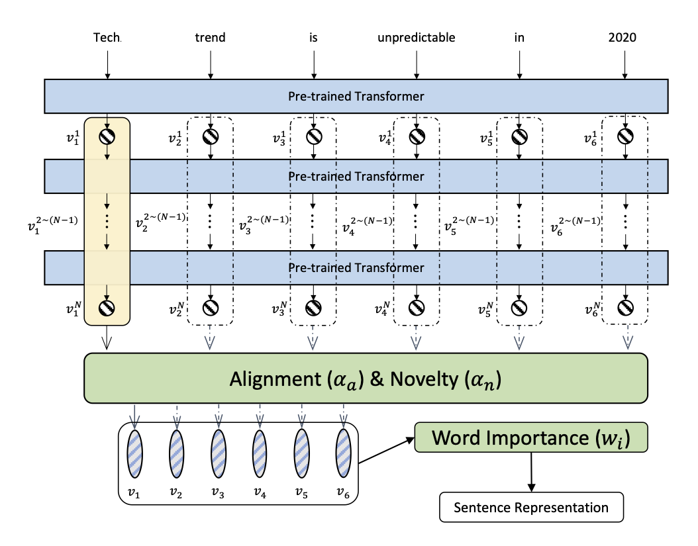
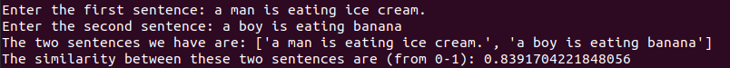

## SBERT-WK: A Sentence Embedding Method By Dissecting BERT-based Word Models
<p align="center">

</p>

SBERT-WK provides a way to generate sentence embedding by dissecting deep contextualized models. Because pre-trained language models are quite powerful in a wide range of NLP tasks, but how to generate sentence embedding from deep language models is still challenging. Deep models mostly provide word/token level representation. Previous approaches includes averaging token representations or use CLS tokens provides rather poor performance in either textual similarity tasks, clustering and supervised tasks. Through geometric analysis, our model is capable in finding salient components in representation arocss layers and unified token representations. We evaluate our approach on a wide range of tasks and showed its effectiveness.

Our model is applicable to any deep contextualized models and requires no further training. Details of our method can be found in our publication: [SBERT-WK](https://arxiv.org/abs/2002.06652).


| Section | Description |
|-|-|
| [Installation](#Installation) 									| How to setup the environment  	|
| [Support Architecture](#Support-Architecture) 					| Current support architectures		|
| [Quick Usage Guide](#Quick-Usage-Guide)							| A quick guide 					|
| [Reproduce the result](#Reproduce-the-result)						| Reproduce the result of paper     |
| [Performance](#Performance)										| Performance Comparison		    |
| [More Scripts](#More-Scripts)                                     | More Scripts to use               |
| [Citation](#Citation)												| Reference Link		   		 	|
| [Acknowledge](#Acknowledge)										| Acknowledge		   		 		|


## Installation
We are using Python 3.7 and the model is implemented with Pytorch 1.3.
We also use [transformers v2.2.2](https://github.com/huggingface/transformers)

**Create a new environment**
```
conda create -n SBERT-WK python=3.7
conda activate SBERT-WK
```

**Install the dependencies**

```
conda install numpy
conda install pytorch=1.3 torchvision cudatoolkit=10.1 -c pytorch
pip install transformers==2.2.2
conda install -c anaconda scikit-learn
```

## Support Architecture

### Released Architectures

We have more scripts for using different pre-trained models：

- **bert-base-nli**: 12 layers, [Model_Page](https://github.com/BinWang28/SBERT-WK-Sentence-Embedding/tree/master/scripts/bert-base-nli)
- **bert-base-nli-stsb**: 12 layers, released with paper [Sen-BERT](https://arxiv.org/abs/1908.10084)


### Under preparation

- **bert-base-uncased**: 12 layers, released with paper [BERT](https://arxiv.org/abs/1810.04805)
- **bert-large-uncased**:
- **bert-large-nli**:
- **bert-large-nli-stsb**:
- **roberta-base**:
- **xlnet-base-cased**:
- **bert-large**:
- **bert-large-nli**:


## Quick Usage Guide

We provde a script as an example for generate sentence embedding by giving sentences as strings.

Simply run the script
```
chmod +x example2.sh
./example2.sh
```
You should see the following interaction asking for sentence:
<p align="center">

</p>


## Reproduce the result

### Option 1:

Download data for STS and downstream tasks
```
./SBERT-WK-Sentence-Embedding-master/SentEval/data/downstream/get_transfer_data.bash
```

Run our code file to reproduce the result. (example given by bert-base-nli)
```
python SBERT_WK.py \
    --model_type 'binwang/bert-base-nli' \
    --embed_method 'dissecting'  \
    --max_seq_length 128 \
    --batch_size 64 \
    --context_window_size 2 \
    --tasks 'sts' \
```
We have shared 7 models from the https://huggingface.co/models. All the models can be easily accessed by changing the model_type in the above command.
```
    --model_type 'binwang/bert-base-uncased'    # Original BERT Model                        (12 layers)
    --model_type 'binwang/roberta-base'         # Original RoBERTa Model                     (12 layers)
    --model_type 'binwang/xlnet-base-cased'     # Original XLNET Model                       (12 layers)
    --model_type 'binwang/bert-base-nli' #      # BERT Model finetuned on NLI data           (12 layers)
    --model_type 'binwang/bert-base-nli-stsb'   # BERT Model finetuned on NLI and STSB data  (12 layers)
    --model_type 'binwang/bert-large-nli'       # Large BERT finetuned on NLI data           (24 layers)
    --model_type 'binwang/bert-large-nli-stsb'  # Large BERT finetuned on NLI and STSB data  (24 layers)
```
The way to obtain the sentence embedding from the deep contextualized model can be two ways:
```
    --embed_method 'dissecting'
    --embed_method 'ave_last_hidden'
```
Choose tasks to evaluate on:
```
    --tasks 'sts'
    --tasks 'supervised'
    --tasks 'probing'
    --tasks 'all'
```

### Option2: simpy run our provided script to evaluate on STS, Downstream and Probing tasks
```
./example1.sh
```

## Performance

### Performance on STS tasks

|    Model                 | STS12 | STS13 | STS14 | STS15 | STS16 | STS-B | SICK-R | Avg.   |
|--------------------------|-------|-------|-------|-------|-------|-------|--------|--------| 
| Avg. GloVe               | 52.22 | 49.60 | 54.60 | 56.26 | 51.41 | 64.79 | 79.92  |  58.40 |
| InferSent                | 59.33 | 58.85 | 69.57 | 71.26 | 71.46 | 75.74 | 88.35  | 70.65  |
| USE                      | 61.00 | 64.00 | 71.00 | 74.00 | 74.00 | 78.00 | 86.00  | 72.57  |
| BERT - CLS               | 27.58 | 22.52 | 25.63 | 32.11 | 42.69 | 52.14 | 70.05  | 38.96  |
| Avg. BERT                | 46.87 | 52.77 | 57.15 | 63.47 | 64.51 | 65.22 | 80.54  | 61.50  |
| Sen-BERT (bert-base-nli) | 64.61 | 67.54 | 73.22 | 74.34 | 70.13 | 74.09 | 84.23  | 72.59  |
| SBERT-WK (bert-base-nli) | 70.22 | 68.13 | 75.46 | 76.94 | 74.51 | 80.00 | 87.38  | 76.09  |


## More Scripts
The following scripts are provided to reproduce more results:
- Reproduce the result of Sentence-BERT (bert-base-nli model)
```
./scripts/sentence-bert/bert-base-nli.sh
```

- Reproduce the result of SBERT-WK (bert-base-nli model)
```
./bert-base-nli/bert-base-nli.sh
```

## Citation

If you find our model is useful in your research, please consider cite our paper: [SBERT-WK: A Sentence Embedding Method By Dissecting BERT-based Word Models](https://arxiv.org/abs/2002.06652):

``` 
@ARTICLE{SBERT-WK,
  author={B. {Wang} and C. -. J. {Kuo}},
  journal={IEEE/ACM Transactions on Audio, Speech, and Language Processing}, 
  title={{SBERT-WK}: A Sentence Embedding Method by Dissecting {BERT}-Based Word Models}, 
  year={2020},
  volume={28},
  pages={2146-2157},}
```

```
@article{SBERT-WK,
    title = {{SBERT-WK}: A Sentence Embedding Method By Dissecting BERT-based Word Models},
    author = {Wang, Bin and Kuo, C-C Jay},
    journal={arXiv preprint arXiv:2002.06652},
    year={2020}
}
```

Contact person: Bin Wang, bwang28c@gmail.com

http://mcl.usc.edu/


## Acknowledge

Many thanks for 

1. [Transformer repo](https://github.com/huggingface/transformers)
2. [Sentence-BERT repo](https://github.com/UKPLab/sentence-transformers) in providing pretained models and easy to use architecture.
3. [SentEval](https://github.com/facebookresearch/SentEval) Evluation toolkit.


